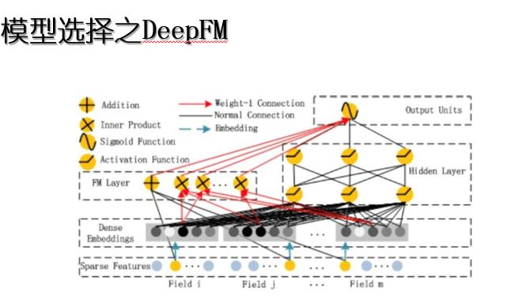

#知识图谱助力电影推荐 
>Movie Recommendation Based on Knowledge Graph
>Date: 2018.08 [DeeCamp](https://ai.chuangxin.com/ai-edu?lang=zh-CN) & PKU & [创新工场](https://chuangxin.com/)

- 项目背景
- 数据预处理
- 负样本生成
- 知识图谱的抽取与融合
- 知识图谱嵌入
- 传统推荐方法
- 基于知识图谱的电影推荐
- 推荐理由生成
- 遇到的困惑
- 参考文献

##项目背景  
>Project BackGround

传统的推荐系统只使用用户和物品的历史交互信息作为输入，这会带来两个问题：
1. **稀疏性**
例如，一个电影类APP可能包含了上万部电影，然而一个用户打过分的电影可能平均只有几十部。使用如此少量的已观测数据来预测大量的未知信息，会极大地增加算法的过拟合风险；
2. **冷启动问题**
对于新加入的用户或者物品，由于系统没有其历史交互信息，因此无法进行准确地建模和推荐。
解决稀疏性和冷启动问题的一个常见思路是在推荐算法中额外引入一些辅助信息作为输入。常见的辅助信息包括以下几种：
**社交网络，用户/物品属性，多媒体信息，上下文信息**
而在各种辅助信息中，知识图谱作为一种新兴类型的辅助信息近几年逐渐引起了研究人员的关注。知识图谱是一种语义网络，能够提供实体之间丰富的语义关联，跳出用户在某一单一场景下的行为局限。基于用户的行为挖掘出用户在知识图谱中的兴趣点，然后通过知识的扩散，能够为用户提供更加精确、多样以及可解释的推荐结果。其结点代表实体或者概念，边代表实体/概念之间的各种语义关系。一个知识图谱由若干个三元组组成，其中h和t代表一条关系的头节点和尾节点，r代表关系。
和其它种类的辅助信息相比，知识图谱的引入可以让推荐结果更加具有精确性、多样性和可解释性。
**知识图谱的特征学习为知识图谱的每种实体和关系学习得到一个低维向量，同时保持图中的结构和语义信息。** 知识图谱特征学习有以下几点好处：
- 降低知识图谱的高维性和异构性 
- 减轻特征工程的工作量
- 减少由于引入知识图谱带来的额外计算负担 
- 增强知识图谱应用的灵活性

子问题1：给定用户行为数据集和知识图谱数据集，构建基于知识图谱的推荐算法，尽可能提高推荐效果
子问题2：对于每一次推荐的物品，从知识图谱中找到用户可能对此物品感兴趣的点，然后基于此生成一句话的推荐理由

##数据预处理
>Data Processing

数据集格式详细说明： 
1. Movie.txt

2. all_instances.zip  是OWL格式的知识库，可以根据需要⾃自⾏行行解析。 
3. UserMovie_train.txt

原始数据噪声很大，主要存在以上几种问题：
大小写混用，简繁体混用，分隔符的混用，存在特殊字符/转义字符，还有一些语义采用多种文本进行表达，比如喜剧和喜剧片等。这其中比较难的是分隔符的不规整和文本表达方式的多样性。
针对以上两个问题我们有以下处理规则：
1. 字段分割：首先对原始数据的文本根据语种进行分割，在日文/韩文/中文中采用空格进行分割，并且去除冗余的信息
3. 语义模糊：人为定义了一些规则，比如喜剧片=喜剧、USA=美国=U.S.A等。

最后的数据格式是，以分号进行连接具有多类值的数据。此外，我们还发现，原始的用户观影数据存在很大的冗余，也即是原始数据大小800万+,有150万+的重复数据。
数据清洗之后，对数据进行简单的统计规则分析，可以看出比较有区分度的特征：

##负样本生成 
>Negative Sample Generatio

假设：默认用户未浏览的电影为负样本。然后定义以下三个生成方案

此外还可以是（1）简单模型进行筛选，去除一部分的数据集（2）反向协同过滤采样

根据模型训练，发现其中，方案一随机生成的样本分布不平衡，导致热门电影被反复推荐，冷门电影无法推荐；方案三的电影聚类效果不佳，大部分用户缺乏历史观影记录，兴趣领域推测误差大;
因此，最后我们选择了方案二，根据电影被观看频次生成对应分布的负样本

注：根据最后的测试集，我们发现第一个方案生成样本是可行的，观影较少的用户对其推荐热门电影的确可行，热门电影反应了绝大多数的观影爱好。后期结合热门进行推荐。

##知识图谱的抽取与融合
>Knowledge Graph Extraction & Fusion

1. 抽取与链接

刚拿到的知识图谱噪声非常大，包含五百万个实体，且大部分与电影无关，因此我们进行了子图抽取与链接，将三元组降低到五十万个，且与movie.txt里面的电影紧密相关。

主要思路如流程图，举个例子：
实体“阿飞正传”连接着“主演”关系，我们认为它是一个电影节点，所以我们把它的三元组全部提取出来；接着我们发现他的主演是“张国荣；张曼玉；刘嘉玲”，在数据清洗这步我们把这一条拆成三条；阿飞正传的“等级”是“UK:15”，这个实体在图谱中只出现过一次，我们把它删掉；再加上后续的几个简单步骤，阿飞正传的子图抽取就完成了。

关于子图抽取注意事项：
抽取电影信息，将电影名称相关的节点取出，相关的演员导演等。
- 子图抽取的大小，方法，要比较不同策略的优缺点
- 如果子图抽取过大，导致噪音和处理速度变慢
- 对于用于抽取信息的字符串，最简单的方式是字符串匹配，考虑模糊匹配
- jena开源工具，将owl转换成三元组，方便后期处理
2. 知识融合

Movie.txt中共有8w多电影实体，而知识图谱中仅提供了1w多电影实体的信息，很难直接基于抽取的子图进行推荐。因此我们把Movie.txt里面的电影信息进行筛选及清洗后，整合为三元组的形式加入到抽取的子图中，进行了融合，最后得到了188w与电影有关的三元组。其中也有一些小的tricks：比如，我们现有的知识图谱都是单向边的，为了平衡连通度和计算复杂度，我们把导演、编剧、主演和制片人对应的三元组reverse之后加入图谱中。
##知识图谱嵌入
>Knowledge Graph Embedding

将图做分解和embedding，形成特征向量

Trans系列借助知识图谱三元组之间的关系来进行entity和relation的embedding。
最简单的想法是让head+relation尽可能等于tail，这就产生了第一种算法TransE。
TransE比较适合处理1对1的这种关系，而不太适用于1对n、n对1、和n对n的这些关系。
TransH即将head和tail根据relation的不同，映射到不同的空间中去。
TransR算法，不使用转换向量，改用矩阵来将h和t映射到完全不同的空间中去。这种做法效果较好，但是涉及大量矩阵运算，时间复杂度和空间复杂度都较高，通常需要TransE的结果作为向量的初始化。
最终有人提出TransD，其在进行转换时考虑了r和h或r和t进行组合得到的转换向量应该不同的问题，取得了以上四种方法中最好的效果，并且训练难度比TransR简单许多。
尝试实验各类trans方法对图中的每一个结点做向量表达，做成特征，简单的选择一个分类模型，将特征输入，查看实验效果

Triple Classification，又称三元组分类: 三元组分类是确定测试数据中事实是否正确，通常被认为是一个二元分类问题。是我们embedding的评测指标之一，在测试集上进行三元组的二分类并计算准确率。由此图表可见，我们的知识图谱清洗融合前后，效果提升非常显著。

##传统推荐方法 
>Feature-based Methods

基本流程：特征工程 -> 模型选择 -> 召回排序
1. 候选集：采用全集候选
传统推荐方法的基本流程是先进行特征工程，再选择特定的模型进行训练，最后由于候选全集较大，我们采用了先召回后排序的策略。
2. 特征工程
数据清洗，加入统计特征，数值型特征归一化处理
特征工程方面，我们得到共18个域，60列，将近32w维的特征。主要的处理包括，数据清洗，舍弃了如电影时长等原始数据集中质量较差的特征；增加了用户的统计特征，如用户的平均打分，观影数量等；还有对数值型特征进行归一化处理等。
3. 模型选择

基于考虑到普通的线性模型只能独立考虑各个特征，因此增加了一项用以表示特征间的交叉关系，它的优点是迭代迅速，简单有效。

它是FM模型和神经网络模型的融合，左侧的FM模型用于学习简单的交叉特征，右侧的神经网络模型用于学习更加复杂的交叉特征，最后再将两者融合，得到最终结果。

它认为在embedding输入到神经网络之后学习的交叉特征表达并不充分，提出了一种product layer的思想，既基于乘法的运算来体现特征交叉的DNN网络结构，根据在product layer采用内积和外积的区别，可实现ipnn和opnn两种模型。
4. 召回排序
由于全集候选集过大，在召回策略方面， 我们尝试了召回热门电影和以基于协同过滤来召回候选集这两种方式。先召回再进行排序。
实验结果

这是我们在两种召回方式上尝试的四个模型的结果。可以看到，以协同过滤的方式召回显著好于以热门电影召回的策略，同时在两种召回策略上，都是**DeepFM模型**表现更佳。

##基于知识图谱的电影推荐
>Knowledge-enhanced Methods

基于知识图谱的电影推荐有两大类算法：
- 基于路径搜索，希望从图上搜索到推荐的目标节点：路径搜索存在随机游走导致计算复杂等问题，但最本质的缺陷是需要人为的定义游走规则。
- 基于图谱嵌入，会把节点和关系映射到向量空间，再做后续分析：基于嵌入的方法会丢失图上的连接信息，使得推荐结果的可解释性很弱。

RippleNet则利用路径搜索方法构建用户的近邻图，用近邻图辅助用户和电影的向量嵌入。由于近邻图的存在，加上学习出了近邻图中每条边的权重，通过观察这个权重可以知道哪些近邻边对推荐某部电影最有帮助，这样就大大增强了推荐系统的可解释性。

一开始我们生成与正样本等量的负样本，recall比较低，我们认为这是因为做召回时正负样本的比例其实不均衡，所以我们按照1:5的比例生成负样本，发现recall提高了1%，再增大负样本比例到1:10，发现recall提升不大。
我们分别基于热门推荐和CF的预筛，用rippleNet推荐了50部电影，precision和recall分别如图。
##推荐理由生成 
>Recommendation Reason Generation

主要思路：利用Ripple Network得到的权重，取最大权重路径上的节点作为推荐依据，生成可解释性文本。

##遇到的困惑

1. 结果困惑:令人疑惑的是，我们前几个较为复杂的模型虽然取得了一定的效果，最佳的大约有8%左右的召回率，但是最终我们最好的模型是由协同过滤取得的，此处我们采用了基于知识图谱的协同过滤取得了最佳的11.6%的召回。
Item-based协同过滤工作过程：
•Step1: 根据用户的打分结果作为物品的特征向量来计算物品间的相似度；
•Step2: 使用用户已经打分的物品根据物品间的相似度来预测未打分物品的分数值；
•Step3: 根据分数值高低来对物品进行排序，得到用户的推荐结果。
一开始，我们尝试了基于用户的协同过滤，相似度采用皮尔逊系数计算，效果不佳（top50 recall:0.8%)；
之后我们尝试了基于物品的协同过滤，采用Jaccard系数结合余弦相似度的方法衡量相似度，取得了10%以上的召回(top50 recall: 10%+)。
实验结果：

可以看到协同过滤明显优于热门召回，最佳模型是基于知识图谱的协同过滤。（召回率11.6%）
2. 如何在大型的知识图谱上进行快速查询？
hive上进行查询，底层使用presto或者Map,reduce
3. 数亿节点的知识图谱用什么tool进行构建 ？
可以基于结构化数据进行构建,直接就是从数据仓库将数据拉出来，然后做entity linking等工作；超过一定数级的知识图谱，不考虑可视化，可视化可以参考北大袁晓茹老师的实验室
4. owl的知识图谱数据导入?
fuseki ,protege 或者转化为nt或者ttl文件进行导入
##参考文献
>References

[1] Factorization machines with libfm
[2] DeepFM: A Factorization-Machine based Neural Network for CTR Prediction
[3] Deep & Cross Network for Ad Click Predictions
[4] xDeepFM: Combining Explicit and Implicit Feature Interactions for Recommender Systems
[5] DKN: Deep Knowledge-Aware Network for News Recommendation
[6] Collaborative knowledge base embedding for recommender systems.
[7] Imbalanced-learn: A Python Toolbox to Tackle the Curse of Imbalanced Datasets in Machine Learning 
[8] Explaining Collaborative Filtering Recommendations 